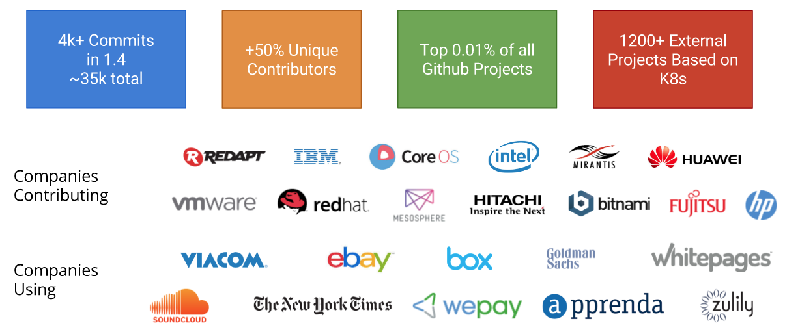

# Kubernetes Overview

## What is Kubernetes

Kubernetes is a platform for managing containerized distributed applications based on the microservices architecture.

 *Planet Scale*
Designed on the same principles that allows Google to run billions of containers a week, Kubernetes can scale without increasing your ops team.

 *Never Outgrow*
Whether testing locally or running a global enterprise, Kubernetes flexibility grows with you to deliver your applications consistently and easily no matter how complex your need is.

 *Run Anywhere*
Kubernetes is open source giving you the freedom to take advantage of on-premise, hybrid, or public cloud infrastructure, letting you effortlessly move workloads to where it matters to you.

## Excourse Distributed Systems & Microservices

### Microservices are ..

> In microservice architectures, applications are built and deployed as simple, highly decoupled, focussed services. They connect to each other over lightweight language agnostic communication mechanisms, which often times means simple HTTP APIs and message queues. Services are built around business capabilities and independently changeable and deployable with only a bare minimum of centralized management. They are polyglot in terms of programming languages, frameworks, and data stores used. Lastly, microservices are resilient, which means they are immutable artifacts that are designed to fail and elastic in scale.

### Core Ideas

- Decoupled Services
- Lightweight Communication
- Polyglot
- Resilience
    - Designed To Fail
    - Elastic in Scale

### Designed To Fail

Availabiliy = MTBF / (MTBF + MTTR)

Focus on minimizing MTTR instead of MTBF

## History

Based on 15 years of experience of running production workloads at Google.
["Borg, Omega, and Kubernetes" March 2016](http://queue.acm.org/detail.cfm?id=2898444)

Coordination and consensus via Paxos (etcd). 
["Consensus in the Cloud: Paxos Systems Demystified" February 2016](https://www.cse.buffalo.edu/tech-reports/2016-02.pdf)

## Architecture

### Kubernetes consists of 5 main components

3 Master Components
- Apiserver
  http://kubernetes.io/docs/admin/kube-apiserver/
- kube-controller-manager
  http://kubernetes.io/docs/admin/kube-controller-manager/
  replication controller, endpoints controller, namespace controller, and serviceaccounts controller.
- kube-scheduler
  http://kubernetes.io/docs/admin/kube-scheduler/

2 Worker/Node Components    
- kube-proxy
  http://kubernetes.io/docs/admin/kube-proxy/
- kubelet
  http://kubernetes.io/docs/admin/kubelet/

### Core Principles 

*Portable*
public, private, hybrid, multi-cloud

*Extensible*
modular, pluggable, hookable, composable

*Self-healing*
auto-placement, auto-restart, auto-replication, auto-scaling

## Features

Feature list as of Kubernetes v1.4 from the [official documentation](http://kubernetes.io/docs/whatisk8s/):
- co-locating helper processes, facilitating composite applications and preserving the one-application-per-container model,
- mounting storage systems,
- distributing secrets,
- application health checking,
- replicating application instances,
- horizontal auto-scaling,
- naming and discovery,
- load balancing,
- rolling updates,
- resource monitoring,
- log access and ingestion,
- support for introspection and debugging, and
- identity and authorization.

## Community

https://github.com/kubernetes/kubernetes

~900 Contributors and growing
from Google, Red Hat, Microsoft, CoreOS, Mesosphere, and many more

Companies using
ebay, box, Goldman Sachs, OpenAI, and many more

Release Cycle: about every [three months](https://github.com/kubernetes/features/blob/master/release-1.5/release-1.5.md)

## Why Kubernetes

- Mature Platform
  - 15 years of experience at Google
  - Best-of-breed ideas and practices from the community
- Vibrant and active community that is inclusive
- Primitives instead of Frameworks
- Low lock-in to single technologies
  - Through abstraction of container engine, networking, storage

## Further Reading

### Kubernetes

- [What is Kubernetes?](http://kubernetes.io/docs/whatisk8s/)
- [Design Principles](https://github.com/kubernetes/kubernetes/blob/master/docs/design/principles.md)
- [Kubernetes Design Overview](https://github.com/kubernetes/kubernetes/blob/master/docs/design/README.md)
- [Kubernetes architecture](https://github.com/kubernetes/kubernetes/blob/master/docs/design/architecture.md)
- [Why Kubernetes is Foundational for Fortune 500 Digital Transformation (and the Cloud Infrastructure Management Landscape)](http://www.work-bench.com/blog/2016/07/12/why-kubernetes-is-foundational-for-fortune-500-digital-transformation)
- [The Rapid Evolution of Kubernetes](http://redmonk.com/fryan/2015/08/10/the-rapid-evolution-kubernetes/)

### Microservices

- [Introduction to Microservice Architectures](https://giantswarm.io/microservices/)
- [The 12-Factor App](https://12factor.net/)